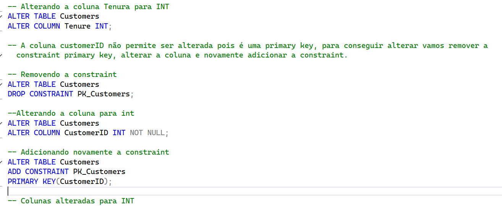
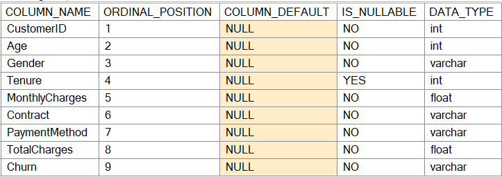
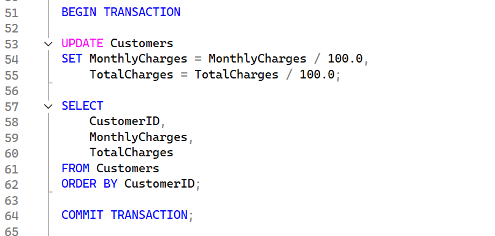
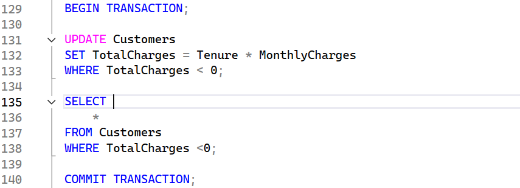
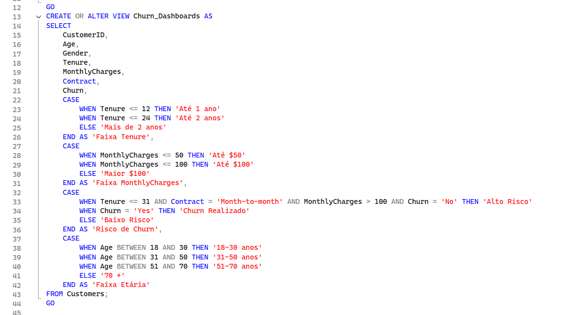
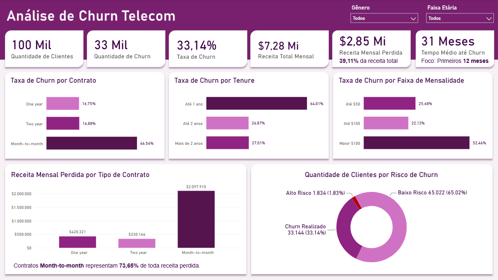

#  Análise de Churn – Telecom

Identificação dos fatores associados ao cancelamento de clientes em uma empresa de telecomunicações.

##  Objetivo

Neste projeto analisei uma base de dados fictícia do Kaggle com dados de clientes de uma empresa de Telecom, com o objetivo de descobrir qual perfil de clientes apresenta maior churn.

**Pergunta principal:**
> Quais características estão mais presentes nos clientes que cancelam?

## Base de dados

[Telco Customer Churn Data – Kaggle](https://www.kaggle.com/datasets/dhrubangtalukdar/telco-customer-churn-data?resource=download)

| Coluna | Descrição |
|---|---|
| `CustomerID` | Identificador do cliente |
| `Age` | Idade |
| `Gender` | Gênero |
| `Tenure` | Número de meses que o cliente está com a empresa |
| `MonthlyCharges` | Valor da fatura mensal |
| `Contract` | Tipo de contrato |
| `PaymentMethod` | Método de pagamento |
| `TotalCharges` | Total de cobranças |
| `Churn` | Se o cliente cancelou o serviço ou não |

## Limpeza de dados

Antes de iniciar as análises, foi realizada uma etapa de limpeza para garantir a qualidade e a consistência das informações utilizadas no projeto. Principais inconsistências encontradas e tratadas:

**1. Tipos de coluna incorretos**
As colunas `CustomerID` e `Tenure` estavam como `VARCHAR`, impossibilitando cálculos. Ambas foram convertidas para `INT`.

**2. Separadores decimais incorretos**
Os valores monetários não estavam com os separadores decimais corretos. Cada coluna monetária teve o valor dividido por 100.

**3. Valores negativos em `TotalCharges`**
265 linhas tinham valores negativos em `TotalCharges`. Como a regra matemática da base é `Tenure * MonthlyCharges = TotalCharges`, os valores negativos foram recalculados com base nessa fórmula.

**4. Ruído em `TotalCharges`**
Por se tratar de uma base gerada artificialmente, um pequeno ruído foi atribuído aos valores de `TotalCharges` — mesmo com a regra `Tenure * MonthlyCharges = TotalCharges`, apenas 269 linhas são 100% compatíveis com o cálculo. Esse ruído pode representar fatores como juros, descontos ou mudanças de contrato, então os ruídos foram mantidos — mas a coluna `TotalCharges` foi **excluída das análises** por não ser 100% confiável.

>  Todo o processo de limpeza está disponível em [`01 - Limpeza_de_Dados.sql`](./querys/01%20-%20Limpeza_de_Dados.sql).

## Análise Exploratória (EDA)

Após a limpeza, foi realizada uma Análise Exploratória de Dados (EDA) com o objetivo de compreender o comportamento da base, identificar padrões e definir quais variáveis seriam utilizadas nas análises e no dashboard.

**Perguntas respondidas:**
- Qual a taxa geral de churn?
- Clientes novos cancelam mais?
- Qual tipo de contrato apresenta maior taxa de churn?
- Qual faixa etária apresenta maior taxa de cancelamentos?
- Qual método de pagamento apresenta maior taxa de cancelamentos?
- O gênero influencia no cancelamento?
- Clientes com pagamentos mensais mais altos cancelam mais?
- Qual a média de tempo até cancelarem?
- Qual o impacto mensal financeiro do churn?
- Quais clientes apresentam perfil que pode indicar um possível churn futuro?

**Principais insights:**

| Métrica | Resultado |
|---|---|
| Taxa geral de churn | **33,14%** |
| Churn em clientes com até 12 meses | **64,01%** |
| Churn em contratos Month-to-Month | **46,56%** |
| Churn em clientes com mensalidade mais alta | **52,46%** |
| Tempo médio até o churn | **31 meses** (mediana de 28 meses) |

> Todas as consultas utilizadas na EDA estão disponíveis em [`02 - EDA.sql`](./querys/02%20-%20EDA.sql).

## Preparação dos dados para o dashboard

Antes de conectar os dados ao Power BI, foi criada uma **view** no SQL Server com o objetivo de evitar transformações desnecessárias no Power BI e centralizar a lógica de preparação dos dados no banco.

**Transformações aplicadas:**
- Seleção apenas das colunas utilizadas nas análises
- Criação de faixa de `Tenure`
- Criação de faixa de `MonthlyCharges`
- Criação da coluna `Risco de Churn`
- Criação de faixa etária

> O código completo da view está disponível em [`03 - View_Dashboard.sql`](./querys/03%20-%20View_Dashboard.sql).

## Visualização dos dados

O objetivo do dashboard foi transformar as análises realizadas em SQL em uma ferramenta visual e interativa, permitindo acompanhar os principais indicadores de churn e identificar rapidamente os fatores associados ao cancelamento.

**[Acessar o dashboard](https://app.powerbi.com/view?r=eyJrIjoiZWJmOGY3OGEtMzU5NS00ZDljLWE3YTgtNzhmNTI2OGRjOThjIiwidCI6IjY1OWNlMmI4LTA3MTQtNDE5OC04YzM4LWRjOWI2MGFhYmI1NyJ9)** 

**Planejamento do dashboard:**
- Definir os melhores indicadores
- Definir quais medidas eram necessárias
- Escolher os gráficos mais adequados para a visualização
- Definir a organização do layout facilitando a leitura
- Escolher as segmentações de dados aplicáveis

**Elementos do dashboard:**

| Elemento | Descrição |
|---|---|
| **KPIs** | Principais indicadores: taxa de churn, receita mensal perdida e tempo médio até o cancelamento |
| **Churn por Contrato** | % de churn entre os 3 tipos de contrato disponíveis |
| **Churn por Tenure** | Em qual faixa de tempo os clientes mais cancelam |
| **Churn por Faixa de Mensalidade** | Qual faixa de pagamento mensal apresenta maior perda de clientes |
| **Receita Mensal Perdida por Tipo de Contrato** | Comparação de receita perdida por contrato e % sobre o faturamento total |
| **Clientes por Risco de Churn** | Quantos clientes estão em baixo/alto risco vs. churn já realizado |
| **Segmentações** | Filtros por gênero e faixa etária, aplicáveis a todos os KPIs e gráficos |

## Insights

A maior taxa de churn foi observada entre clientes com contratos **Month-to-Month (46,56%)**, significativamente superior aos contratos de 1 ano (16,75%) e 2 anos (16,88%) — indicando que contratos de curto prazo favorecem a decisão de cancelamento.

O tempo de permanência também é um fator relevante: embora o tempo médio até o churn seja de aproximandamente 31 meses, a maior concentração de cancelamentos ocorre nos **primeiros 12 meses**, período em que a taxa de churn alcança **64,01%**. Isso sugere que os primeiros meses são decisivos para a retenção, podendo indicar dificuldades no onboarding, na adaptação ao serviço ou na geração de valor logo após a contratação.

A mensalidade também mostrou forte relação com o cancelamento: clientes que pagam mais de **$100/mês** têm taxa de churn de **52,46%**, o que pode indicar percepção insuficiente de custo-benefício nos planos de maior valor.

Os contratos Month-to-Month representam o maior impacto econômico para a empresa, concentrando aproximadamente **73,65%** de toda a receita mensal perdida — cerca de **$2,1 milhões** em receita comprometida.

## Conclusão

Os resultados indicam que o churn não ocorre de forma aleatória, mas está concentrado em um perfil específico de clientes: aqueles com **contratos flexíveis (Month-to-Month)**, **pouco tempo de relacionamento** com a empresa (até 12 meses) e **mensalidades mais elevadas** (acima de $100).

Com base nesse perfil, algumas estratégias podem contribuir para reduzir a taxa de cancelamento:

- Fortalecer o processo de onboarding e o acompanhamento dos clientes durante os primeiros 12 meses;
- Criar incentivos para migração de contratos Month-to-Month para planos anuais ou bienais, reduzindo a facilidade de cancelamento;
- Revisar a estratégia de precificação dos planos de maior valor, avaliando se o preço está alinhado ao valor percebido pelo cliente ou se benefícios adicionais podem aumentar sua retenção.

---

> *Esta análise identifica correlações entre as características dos clientes e o churn, mas não estabelece relações de causa e efeito. Os resultados servem para direcionar investigações e ações de negócio, que devem ser complementadas por análises adicionais e testes para validar a eficácia das estratégias propostas.*

## Ferramentas utilizadas

- **SQL Server** — limpeza, tratamento e análise exploratória dos dados
- **Power BI** — construção do dashboard interativo

